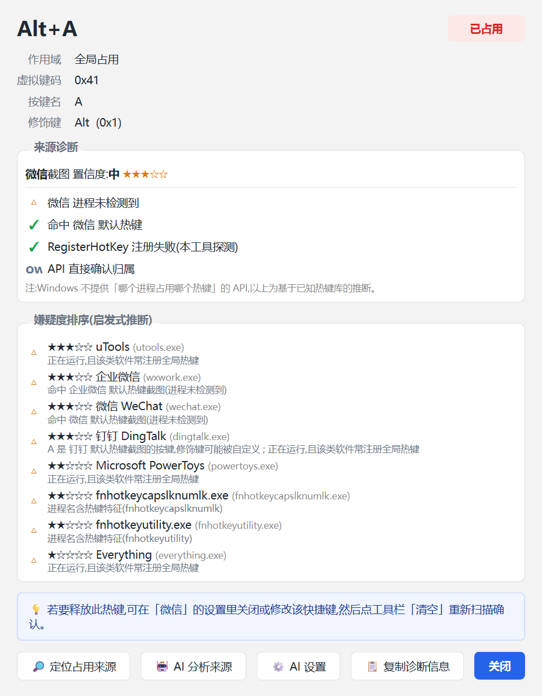
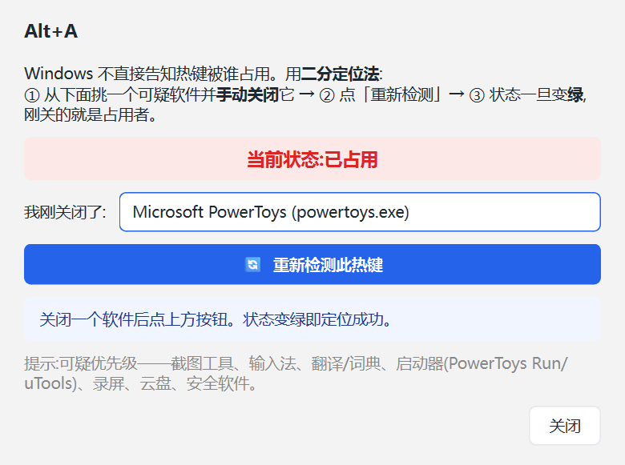

<div align="center">

# ⌨️ 全局热键冲突检测器

**一个 Windows 桌面工具,扫描系统中已被占用的全局热键组合,帮你排查快捷键冲突。**


[⬇️ 下载 exe](#-快速开始) · [📖 文档](#-工作原理) · [🐛 报告问题](https://github.com/hss-ai/hotkey-conflict-detector/issues)

---


</div>

## 🎯 解决什么问题

装了一堆软件后,快捷键经常打架:微信截图、QQ 截图、Snipaste、输入法、PowerToys……各自占了一堆 `Ctrl+Alt+X` / `Alt+Y`,你想设一个新的全局热键却总是"注册失败",又不知道是谁在抢。

本工具逐个探测所有常见的修饰键 + 按键组合,告诉你:

- 哪些组合**已被占用**(无法再注册)
- 哪些是 **Windows 系统保留**的(如 `Win+D`、`Alt+Tab`、`Ctrl+Alt+Del`)
- 哪些**空闲**可用
- 尽力推断占用**来源**(微信 / 钉钉 / QQ 等常见软件的默认热键)

## 📦 快速开始

### 方式一:下载 exe(推荐,免装 Python)

前往 [Releases 页面](https://github.com/hss-ai/hotkey-conflict-detector/releases),下载最新版 `HotkeyConflictDetector-x.y.z-windows-x64.exe`,**双击即可运行**。

> 💡 建议右键「以管理员身份运行」——非管理员探测时,可能因 UIPI 把管理员进程占用的热键误判为空闲。

### 方式二:源码运行

需要 **Windows** + **Python 3.10+**(依赖 Win32 `RegisterHotKey` API)。

```bash
pip install -r requirements.txt
python main.py
```

## ✨ 功能特性

<table>
<tr>
<td width="50%" valign="top">

**🚀 秒级全量扫描**
默认 1300+ 组合,<1 秒完成。后台线程执行,UI 全程不卡顿。

**🔍 单点检测**
顶部捕获框聚焦后按下想设的热键(如 `Ctrl+Alt+J`),即时探测这一个,无需全量扫描。

**🩺 详情诊断面板**
双击任意行 → 弹出 VK 码 / 作用域 / 来源证据链 / 排障建议,一键复制诊断信息。

**🔗 来源证据链 + 置信度**
占用项标注 `✓进程在运行` / `✓命中默认热键` / `✗API无法直接确认`,附星级置信度,不再"瞎猜"。

</td>
<td width="50%" valign="top">



</td>
</tr>
<tr>
<td width="50%" valign="top">



</td>
<td width="50%" valign="top">

**🎛️ 可配置扫描范围**
字母 / 数字 / 功能键 / 导航键 / 符号键 / 小键盘 / 多媒体·浏览器键 / Win 组合,按需勾选。

**🎨 可视化表格**
状态着色、按冲突优先级排序,支持状态 / 搜索 / 仅冲突筛选。

**📊 统计卡片**
总数 / 冲突 / 已占用 / 系统保留 / 空闲 / 异常,一目了然。

**🖥️ 运行中软件检测**
状态栏列出本机正在运行的热键软件。

**💾 导出与分享**
导出 CSV 留档,或一键复制冲突列表到剪贴板。

</td>
</tr>
</table>

## 🆕 v1.1.0 新功能

本版新增 7 项能力,让检测器从「一次性扫描」升级为「持续诊断 + 差异对比」:

| 功能 | 说明 |
|---|---|
| **📁 快照对比** | 扫描后存快照;装软件前后各存一份,对比即知「谁抢了热键」——新增占用 / 已释放 / 状态变化三类 diff |
| **📄 HTML 报告** | 一键导出自包含 HTML 报告(统计卡片 + 冲突表 + 来源 Top),可分享存档 |
| **💡 推荐可用** | 扫描后正向推荐当前空闲、可安全使用的组合(按 `Ctrl+Alt+字母` 友好度排序) |
| **🎯 前台应用上下文** | 状态栏实时显示当前焦点应用,已知热键软件红色高亮提醒 |
| **⏱ 守望模式** | 对一个组合持续探测,记录状态时间线,捕捉「时好时坏」的间歇性占用及当时运行软件 |
| **🔧 热键库可扩展** | 在 `~/.hotkey_detector/user_hotkeys.json` 追加自定义软件热键,证据链会一并考虑 |
| **▶️ 扫描续扫** | 中途停止后,再次扫描可选「继续扫描剩余」而非重来 |

<details>
<summary>📖 用户热键库 JSON 格式(点击展开)</summary>

在 `~/.hotkey_detector/user_hotkeys.json` 放置(目录不存在会自动创建,可用环境变量 `HOTKEY_DETECTOR_HOME` 覆盖位置):

```json
{
  "apps": [
    {"name": "我的软件", "processes": ["myapp.exe"]}
  ],
  "hotkeys": [
    {"modifiers": ["Ctrl", "Alt"], "vk": 74, "app": "我的软件",
     "action": "截图", "processes": ["myapp.exe"]}
  ]
}
```

`modifiers` 支持整数位掩码、`["Ctrl","Alt"]` 列表或 `"Ctrl+Alt"` 字符串;`vk` 是 Win32 虚拟键码(A=0x41、J=0x4A …)。文件损坏或缺失不影响内置库。

</details>

## 📖 工作原理

Windows **没有提供**"枚举所有已注册全局热键"的官方 API。但 `RegisterHotKey` 是全局唯一的——若某组合已被占用,再次注册会失败。本工具据此逐个组合试探(注册 → 立即注销):

| 注册结果 | GetLastError | 含义 | 分类 |
|---|---|---|---|
| 成功 | — | 当前空闲 | 🟢 空闲 |
| 失败 | **1409** `ERROR_HOTKEY_ALREADY_REGISTERED` | 无法注册——可能是被程序注册、系统保留或键盘钩子占用。Windows **统一返回 1409,无法区分**具体原因 | 🔴 已占用 |
| 命中已知系统键表 | — | Windows 系统级快捷键 | ⚪ 系统保留 |

> ⚠️ 经实测确认:① `RegisterHotKey` 失败**只返回 1409**(无论被谁占用;`1419` 是 `UnregisterHotKey` 的错误码,这里不会出现);② `GetLastError` 在 API 成功时可能保留上一次的残留值,所以代码**先看返回值**,只有失败时错误码才有意义;③ Windows 不提供"哪个进程占用哪个热键"的 API,来源识别只能尽力推断。

**探测期间会短暂占用目标组合(注册 → 立即注销,毫秒级),扫描极快(~0.1 秒 / 千组合),影响可忽略。** 扫描期间请勿同时按下被检测的热键。

### 🧭 能力边界(诚实说明)

本工具能可靠检测的是 `RegisterHotKey` 类全局热键的**注册冲突**(能不能注册成功)。无法可靠区分/检测:

- ☓ 占用方到底是谁(程序注册 / 系统保留 / `WH_KEYBOARD_LL` 钩子,都返回同一个 1409)
- ☓ 应用**内部**快捷键(如 Word 的 `Ctrl+B`,只在程序内生效、不占用全局槽位)
- ☓ 管理员权限进程占用的热键(探测器非管理员时可能因 UIPI 误判为空闲)——建议**以管理员身份运行**以获得更准结果

### 🔎 关于"来源识别"与"二分定位"

Windows **不告知**哪个进程占用了哪个热键,因此来源识别只能尽力推断:

- 扫描正在运行的进程,匹配"已知会注册全局热键的软件"清单(状态栏显示);
- 对常见软件的**默认**热键做硬编码映射(如微信 `Alt+A`、钉钉 `Ctrl+Shift+A`、QQ `Ctrl+Alt+A`)。

推断结果**不保证准确**——用户可能改过快捷键,或软件用全局钩子(而非 `RegisterHotKey`)实现热键。结果仅供排障参考。

当推断无法定位时,可使用「来源定位助手」(二分定位法):工具引导你逐批关闭可疑进程,边关边重扫,逐步锁定真正占用者,解决"查不到占用者"的死结。

## 🚀 使用说明

1. 在"扫描范围"勾选要检测的按键类别(默认全选)
2. 点 **▶ 开始扫描**
3. 查看表格——默认按状态列排序,**冲突项排在最前**
4. 用筛选栏(状态 / 仅冲突 / 搜索)快速定位,例如搜索 `Alt+A`
5. **导出 CSV** 留档,或**复制冲突**到剪贴板

## 🛠️ 技术栈

- **Python 3.10+**
- **PySide6 (Qt6)** —— UI 框架
- **ctypes** —— 直接调用 Win32 `RegisterHotKey` / `UnregisterHotKey` / `CreateToolhelp32Snapshot`,**零额外原生依赖**(除 PySide6)

## 📁 项目结构

```
hotkey-conflict-detector/
├── main.py                          # 入口
├── core/
│   ├── _version.py                  # 版本号单点真源(与 git tag 对应)
│   ├── _known_data.py               # 内置热键库 + 用户 JSON 扩展 [v1.1]
│   ├── hotkeys.py                   # 修饰键 / 虚拟键码 / 组合生成 / 系统保留表
│   ├── detector.py                  # RegisterHotKey 探测引擎 + QThread 扫描器(支持续扫)
│   ├── apps.py                      # 进程扫描 + 已知热键来源推断
│   ├── snapshot.py                  # 扫描快照:序列化 / save / load / diff [v1.1]
│   ├── report.py                    # HTML 报告渲染 [v1.1]
│   ├── recommend.py                 # 空闲热键推荐排序 [v1.1]
│   ├── foreground.py                # 前台窗口进程探测 [v1.1]
│   └── watch.py                     # 守望状态机 + 转变检测 [v1.1]
├── ui/
│   ├── style.py                     # QSS 样式表与配色
│   ├── models.py                    # 表格模型 + 筛选代理
│   ├── detail_dialog.py             # 详情诊断面板
│   ├── locate_dialog.py             # 来源定位助手(二分定位法)
│   ├── snapshot_dialog.py           # 快照对比对话框 [v1.1]
│   ├── recommend_dialog.py          # 空闲推荐对话框 [v1.1]
│   ├── watch_dialog.py              # 守望模式对话框 [v1.1]
│   └── main_window.py               # 主窗口
├── tests/                           # 各模块独立单测 + offscreen 冒烟(CI 友好)
├── .github/workflows/               # CI / 自动构建发布
└── assets/                          # 截图
```

## 💻 开发与测试

本地跑离屏冒烟测试(无需真实显示设备):

```bash
pip install -r requirements.txt
# Windows PowerShell
$env:QT_QPA_PLATFORM="offscreen"; python tests/test_smoke_offscreen.py
# 或 Git Bash
QT_QPA_PLATFORM=offscreen python tests/test_smoke_offscreen.py
```

本地打包 exe:

```bash
pip install pyinstaller
pyinstaller --noconsole --onefile --clean --name HotkeyConflictDetector main.py
# 产物在 dist/HotkeyConflictDetector.exe(约 48MB)
```

## 🏷️ 版本管理

版本号遵循 [语义化版本(SemVer)](https://semver.org/lang/zh-CN/),单点真源为 [`core/_version.py`](core/_version.py),与 git tag 一一对应(`v1.0.0` ↔ `"1.0.0"`)。

发版流程:

1. 更新 `core/_version.py` 的 `__version__`
2. 提交改动
3. `git tag vX.Y.Z && git push origin vX.Y.Z`
4. GitHub Actions 自动构建 Windows exe 并发布 Release ✅

## 📄 许可证

[MIT](LICENSE)
