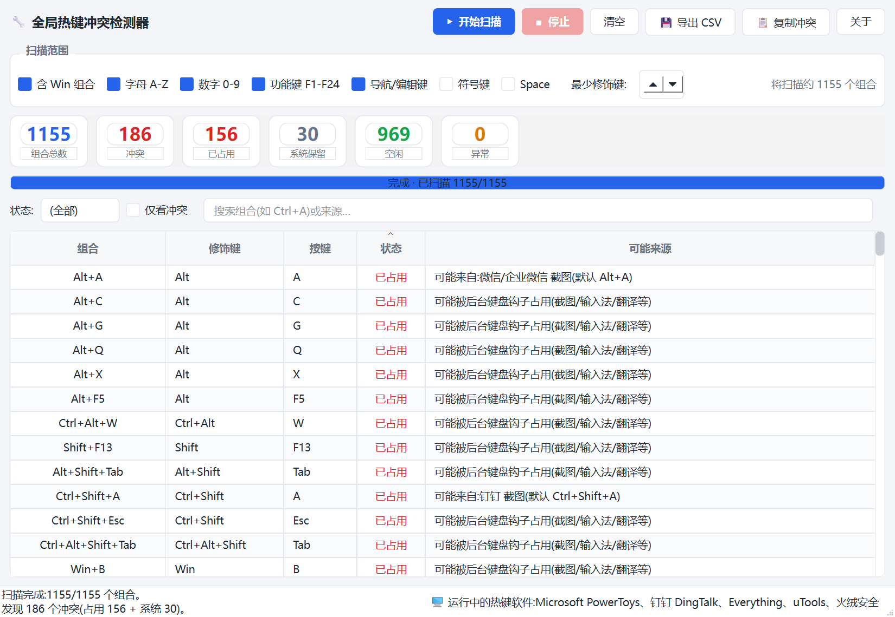

# 全局热键冲突检测器

> 一个 Windows 桌面工具,扫描系统中已被占用的全局热键组合,帮你排查快捷键冲突。



## 解决什么问题

装了一堆软件后,快捷键经常打架:微信截图、QQ 截图、Snipaste、输入法、PowerToys……各自占了一堆 `Ctrl+Alt+X` / `Alt+Y`,你想设一个新的全局热键却总是"注册失败",又不知道是谁在抢。

本工具逐个探测所有常见的修饰键 + 按键组合,告诉你:

- 哪些组合**已被占用**(无法再注册)
- 哪些是 **Windows 系统保留**的(如 `Win+D`、`Alt+Tab`、`Ctrl+Alt+Del`)
- 哪些**空闲**可用
- 尽力推断占用**来源**(微信 / 钉钉 / QQ 等常见软件的默认热键)

## 工作原理

Windows **没有提供**"枚举所有已注册全局热键"的官方 API。但 `RegisterHotKey` 是全局唯一的——若某组合已被占用,再次注册会失败。本工具据此逐个组合试探(注册 → 立即注销):

| 注册结果 | GetLastError | 含义 | 分类 |
|---|---|---|---|
| 成功 | — | 当前空闲 | 🟢 空闲 |
| 失败 | **1419** `ERROR_HOTKEY_ALREADY_REGISTERED` | 已被某程序的 `RegisterHotKey` 占用 | 🔴 已占用 |
| 失败 | **1409** | 被后台键盘钩子占用(截图/输入法/翻译类工具常用 `WH_KEYBOARD_LL`) | 🔴 已占用 |
| 命中已知系统键表 | — | Windows 系统级快捷键 | ⚪ 系统保留 |

> ⚠️ 关键细节:`GetLastError` 在 API 成功时可能保留**上一次的残留值**(实测 1409 会残留),所以必须先看返回值,只有失败时错误码才有意义——本工具已正确处理。

**探测期间会短暂占用目标组合(注册 → 立即注销,毫秒级),扫描极快(~0.1 秒 / 千组合),影响可忽略。** 扫描期间请勿同时按下被检测的热键。

### 关于"来源识别"

Windows **不告知**哪个进程占用了哪个热键,因此来源识别只能尽力推断:

- 扫描正在运行的进程,匹配"已知会注册全局热键的软件"清单(状态栏显示);
- 对常见软件的**默认**热键做硬编码映射(如微信 `Alt+A`、钉钉 `Ctrl+Shift+A`、QQ `Ctrl+Alt+A`)。

推断结果**不保证准确**——用户可能改过快捷键,或软件用全局钩子(而非 `RegisterHotKey`)实现热键。结果仅供排障参考。

## 功能特性

- 🚀 **秒级全量扫描**:默认 1300+ 组合,<1 秒完成(后台线程,UI 不卡)
- 🎛️ **可配置扫描范围**:字母 / 数字 / 功能键 / 导航键 / 符号键 / Win 组合、最少修饰键数
- 🎨 **可视化表格**:状态着色、按冲突优先级排序、状态 / 搜索 / 仅冲突筛选
- 📊 **统计卡片**:总数 / 冲突 / 已占用 / 系统保留 / 空闲 / 异常
- 🖥️ **运行中热键软件检测**:状态栏列出本机正在运行的热键软件
- 💾 **导出 CSV** / 📋 **复制冲突列表到剪贴板**

## 安装与运行

需要 **Windows** + **Python 3.10+**(依赖 Win32 `RegisterHotKey` API)。

```bash
pip install -r requirements.txt
python main.py
```

## 使用说明

1. 在"扫描范围"勾选要检测的按键类别(默认全选)
2. 点 **▶ 开始扫描**
3. 查看表格——默认按状态列排序,**冲突项排在最前**
4. 用筛选栏(状态 / 仅冲突 / 搜索)快速定位,例如搜索 `Alt+A`
5. **导出 CSV** 留档,或**复制冲突**到剪贴板

## 技术栈

- **Python 3.10+**
- **PySide6 (Qt6)** —— UI
- **ctypes** —— 直接调用 Win32 `RegisterHotKey` / `UnregisterHotKey` / `CreateToolhelp32Snapshot`,**零额外原生依赖**(除 PySide6)

## 项目结构

```
hotkey-conflict-detector/
├── main.py                          # 入口
├── core/
│   ├── hotkeys.py                   # 修饰键 / 虚拟键码 / 组合生成 / 系统保留表
│   ├── detector.py                  # RegisterHotKey 探测引擎 + QThread 扫描器
│   └── apps.py                      # 进程扫描 + 已知热键来源推断
├── ui/
│   ├── style.py                     # QSS 样式表与配色
│   ├── models.py                    # 表格模型 + 筛选代理
│   └── main_window.py               # 主窗口
├── tests/
│   ├── test_smoke_offscreen.py      # 离屏冒烟测试(CI 友好)
│   └── capture_preview.py           # 开发用:启动 + 截图
└── assets/preview.png
```

## 测试

```bash
QT_QPA_PLATFORM=offscreen python tests/test_smoke_offscreen.py
```

## 许可证

[MIT](LICENSE)
